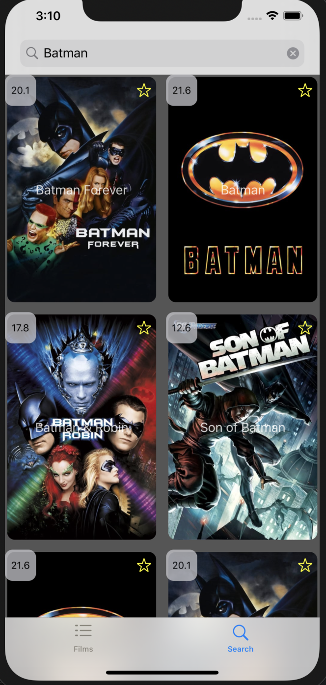

<h4>This is my Cinema app created for educational purposes.()</h4>
This project is using The Movie Dataset API
 
<b>Tab with popular films</b>
 

<b>Top Rated Films</b>
 

<b>Favourite Films</b>
 

<b>Film Details #1</b>
 

<b>Film Details #2</b>
 

<b>Film's full cast and crew</b>
 

<b>Search</b>
 

